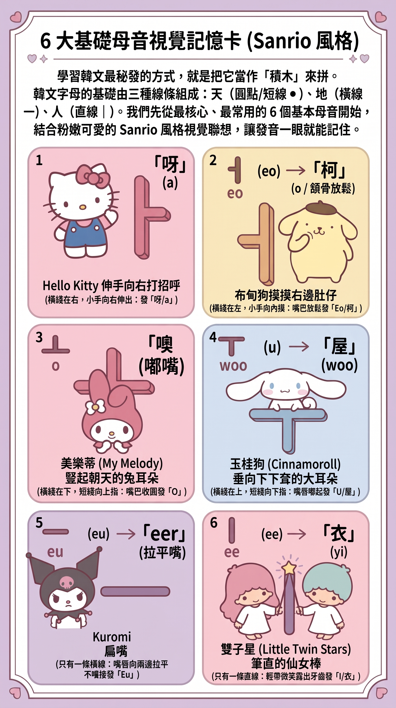

# 🌸 Sanrio 韓語發音積木樂園 (Sanrio Korean Learning Playground)

可愛圖像聯想 + 輕鬆發音 + 韓文積木拼音 + Firebase 雲端即時互動！

  

## ✨ 核心特色

<<<<<<< HEAD
- **🐱 基礎母音專頁**：結合 Hello Kitty、布甸狗、美樂蒂、玉桂狗、Kuromi、雙子星視覺聯想及廣東話口訣（含 `ㅑ, ㅕ, ㅛ, ㅠ` 衍生母音）。
- **🐰 11 大複合母音專頁**：雙母音調色盤（`ㅐ, ㅔ, ㅒ, ㅖ, ㅘ, ㅙ, ㅚ, ㅝ, ㅞ, ㅟ, ㅢ`），滑音與口型過渡口訣。
- **🐶 10 大基礎平音專頁**：基本聲母快速記憶（`ㄱ, ㄴ, ㄷ, ㄹ, ㅁ, ㅂ, ㅅ, ㅇ, ㅈ, ㅎ`）。
- **⚡ 4 大激音（送氣音）專頁**：酷企鵝與水怪噴氣爆破音（`ㅊ, ㅋ, ㅌ, ㅍ`）。
- **💥 5 大硬音（雙子音）專頁**：緊喉硬音雙倍萌力（`ㄲ, ㄸ, ㅃ, ㅆ, ㅉ`）。
- **🧱 7 大代表收音（Batchim）教學專頁**：尾音閉音技巧與生活例詞（`ㅇ, ㅁ, ㄴ, ㄹ, ㅂ, ㄱ, ㄷ`）。
- **🧩 3 層收音拼音積木屋**：初聲 (19) ＋ 中聲 (21) ＋ 終聲 (28) 自由拼詞，完整 11,172 韓文字 Unicode 合成發音，支援無尾音/有尾音即時發音對比。
- **☁️ Firebase 雲端自學單字庫**：學員共享自學單字，點擊即時發音，實時同步儲存至 Firestore。
- **⭐ 隨堂星級自我挑戰測驗**：隨堂測驗評量學習成效，即時回饋與韓文鼓勵。
- **💖 即時集氣加油站**：一鍵為全體學習夥伴加油打氣。
=======
- **🐱 6 大基礎母音字卡**：結合 Hello Kitty、布甸狗、美樂蒂、玉桂狗、Kuromi、雙子星視覺聯想及廣東話口訣，支援大圖海報預覽。
- **🐶 基礎子音積木**：聲母快速記憶與標準發音。
- **🧩 拼音積木屋**：實時聲母＋韻母組合，動態計算 Unicode 韓文字母並支援點擊發音。
- **☁️ Firebase 雲端自學單字庫（獨立分頁）**：即時同步儲存至 Firestore，支援即時搜尋、卡片朗讀與學員自學單字上傳共享。
- **⭐ Sanrio 星級挑戰測驗**：5 題隨堂測驗評量學習成效。
>>>>>>> 52395a4bdd727b03a1a398773c45bc0b1098a7fa

## 🛠️ 技術棧
- **Frontend**：HTML5, React 18 (CDN), Tailwind CSS, Font Awesome
- **Backend / Cloud**：Google Firebase (Firestore & Anonymous Auth)
- **Audio**：Web Speech API (`ko-KR` 韓語語音合成)

## 🚀 線上即時體驗
- **GitHub Pages**：[https://kitty-sin.github.io/sanrio-korean-learning/](https://kitty-sin.github.io/sanrio-korean-learning/)