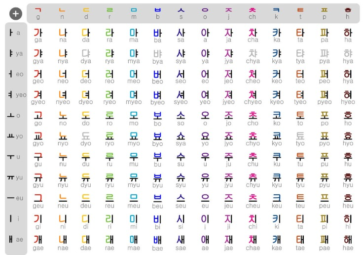
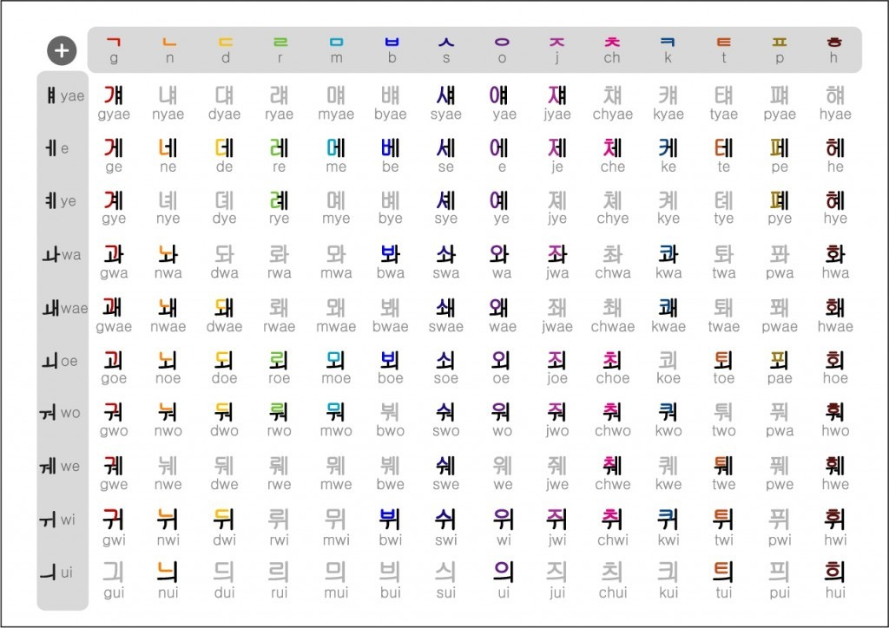

# 🌸 KITTY 韓語發音積木樂園 (KITTY Korean Learning Playground)

Sanrio 萌趣圖像記憶 • 粵語口訣秒懂發音 • 輕鬆玩轉動詞與音變 ✨

  

## ✨ 核心特色

- **🐱 基礎母音專頁**：結合 Hello Kitty、布甸狗、美樂蒂、玉桂狗、Kuromi、雙子星視覺聯想及廣東話口訣（含 `ㅑ, ㅕ, ㅛ, ㅠ` 衍生母音與海報大圖）。
- **🐰 11 大複合母音專頁**：雙母音調色盤（`ㅐ, ㅔ, ㅒ, ㅖ, ㅘ, ㅙ, ㅚ, ㅝ, ㅞ, ㅟ, ㅢ`），滑音與口型過渡口訣。
- **🐶 10 大基礎平音專頁**：基本聲母快速記憶（`ㄱ, ㄴ, ㄷ, ㄹ, ㅁ, ㅂ, ㅅ, ㅇ, ㅈ, ㅎ`）。
- **⚡ 4 大激音（送氣音）專頁**：酷企鵝與水怪噴氣爆破音（`ㅊ, ㅋ, ㅌ, ㅍ`）。
- **💥 5 大硬音（雙子音）專頁**：緊喉硬音雙倍萌力（`ㄲ, ㄸ, ㅃ, ㅆ, ㅉ`）。
- **🧱 7 大代表收音（Batchim）教學專頁**：尾音閉音技巧與生活例詞（`ㅇ, ㅁ, ㄴ, ㄹ, ㅂ, ㄱ, ㄷ`）。
- **🧩 3 層收音拼音積木屋**：初聲 (19) ＋ 中聲 (21) ＋ 終聲 (28) 自由拼詞，完整 11,172 韓文字 Unicode 合成發音，支援無尾音/有尾音即時發音對比。
- **☁️ Firebase 雲端自學單字庫（深度升級）**：
  - **三段速發音示範**：🔊 標準 1.0x、🐢 慢速 0.7x、🦥 極慢速 0.3x（**逐字獨立吐音零失真 ＋ 450ms 精準停頓 ＋ 畫面同步粉紅高亮跳動**）。
  - **🧩 單字字母拆解彈窗**：各音節初聲、中聲、終聲積木結構深入分析與單字點讀。
  - **🎤 AI 語音跟讀挑戰彈窗**：Web Speech 語音辨識 ＋ **Jamo 字母層級比對演算法** ＋ 0~100 分與 ⭐⭐⭐ 星級反饋。
  - **⚡ 自動即時羅馬拼音解析**：輸入韓文單字時自動生成標準拼音，表單極致簡化為「韓文」與「中文意思」兩欄，一鍵儲存 Firestore！
- **⭐ 隨堂星級自我挑戰測驗**：隨堂測驗評量學習成效，即時回饋與韓文鼓勵。

## 🛠️ 技術棧
- **Frontend**：HTML5, React 18 (CDN), Tailwind CSS, Font Awesome
- **Backend / Cloud**：Google Firebase (Firestore & Anonymous Auth)
- **Audio & AI**：Web Speech API (`ko-KR` 語音合成 SpeechSynthesis & 語音辨識 SpeechRecognition)
- **Algorithm**：Hangul Unicode Syllable Decomposer, Revised Romanization of Korean, Jamo-level Levenshtein Distance Matcher

## 📚 附屬教材資源
- **📖 Sanrio 韓語發音教學簡報 (20頁完整版 PDF)**：
  - 🌐 [線上即時清晰瀏覽 (GitHub Pages 直連)](https://kitty-sin.github.io/sanrio-korean-learning/hangul_sanrio_deck_20p.pdf)
  - 📥 [直接下載 PDF 原檔 (Raw Download)](https://raw.githubusercontent.com/kitty-sin/sanrio-korean-learning/main/hangul_sanrio_deck_20p.pdf)
- **📑 韓語語序・敬語・時態大解密 (PDF 精美講義)**：
  - 🌐 [線上即時清晰瀏覽 (GitHub Pages 直連)](https://kitty-sin.github.io/sanrio-korean-learning/韓語語序・敬語・時態大解密.pdf)
  - 📥 [直接下載 PDF 原檔 (Raw Download)](https://raw.githubusercontent.com/kitty-sin/sanrio-korean-learning/main/韓語語序・敬語・時態大解密.pdf)
- **🍱 Sanrio 100 個常見食物學習清單 (10頁發音打卡手札 / 支援 A4 列印 PDF)**：
  - 🌐 [線上互動打卡與點讀網頁版 (sanrio_korean_food_100.html)](sanrio_korean_food_100.html)
  - 📝 [完整 Markdown 食物詞表 (sanrio_korean_food_100.md)](sanrio_korean_food_100.md)
- **📊 韓語字母拼音總表 (Hangul Syllable Chart)**：[assets/hangul_alphabet_chart.jpg](assets/hangul_alphabet_chart.jpg)

  

- **🪄 韓語 40 音變速查總表 (Korean 40 Sound Changes Chart)**：[assets/korean_sound_changes_chart.jpg](assets/korean_sound_changes_chart.jpg)

  

## 🚀 線上即時體驗
- **GitHub Pages**：[https://kitty-sin.github.io/sanrio-korean-learning/](https://kitty-sin.github.io/sanrio-korean-learning/)